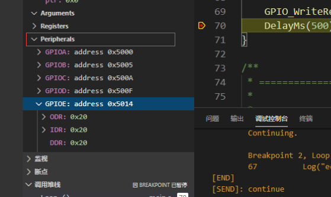

# STM8 Debugger

## Summary 📑

A STM8 Debugger for vscode. Use STLink to debug your STM8 program

**Only for Windows platform**

***


***

## Usage 📖

### Preparatory work

1. Install STLink or RLink driver program
2. If you want to debug **SDCC stm8 program**, you must install OpenOCD and set path

***

### Start 🏃‍♀️

1. Fill in `launch.json`, there are some examples: 

- **Use IAR/COSMIC Toolchain :**

```json
{
    "version": "0.2.0",
    "configurations": [
        {
            "type": "stm8-debug",
            "request": "launch",
            "name": "Launch Program",
            "serverType": "st7",
            "executable": ".\\out\\Debug\\stm8_demo.out",
            "cpu": "STM8S003F3P"
        }
    ]
}
```

- **Use SDCC Toolchain :**

```json
{
    "version": "0.2.0",
    "configurations": [
        {
            "type": "stm8-debug",
            "request": "launch",
            "name": "Launch Program",
            "serverType": "stm8-sdcc",
            "executable": ".\\out\\Debug\\stm8_demo.elf",
            "cpu": "STM8S003F3P",
            "openOcdConfigs": [
                "interface/stlink.cfg",
                "target/stm8s003.cfg"
            ]
        }
    ]
}
```

2. link your STLink and board, press `F5` to launch stm8 debugger

***

## Peripheral View support

You can browse **cpu peripheral value** by **Peripheral View**, like this:




#### built-in peripheral view support

- stm8s103f3
- stm8s003f3
- stm8s105k4

#### custom peripheral view support

**Note:** You need to create a new **\<cpu_name>.svd.json** file to support a new stm8 cpu.

step 1. create a new **<cpu_name>.svd.json** file, write peripheral descriptions.

step 2. set **svdFile** property in **launch.json**

***

There is a demo for `stm8s003f3` cpu, file name: `stm8s003f3.svd.json`

```json
[
    {
        "name": "GPIOA",
        "baseAddress": "0x5000",
        "registers": [
            {
                "name": "ODR",
                "bytes": 1,
                "fields": [
                    {
                        "name": "0",
                        "bitsOffset": 0,
                        "bitsWidth": 1
                    }
                ]
            },
            {
                "name": "IDR",
                "bytes": 1
            },
            {
                "name": "DDR",
                "bytes": 1
            },
            {
                "name": "CR1",
                "bytes": 1
            },
            {
                "name": "CR2",
                "bytes": 1
            }
        ]
    },
    {
        "name": "FLASH",
        "baseAddress": "0x505A",
        "registers": [
            {
                "name": "CR1",
                "bytes": 1
            },
            {
                "name": "CR2",
                "bytes": 1
            },
            {
                "name": "NCR2",
                "bytes": 1
            },
            {
                "name": "FPR",
                "bytes": 1
            },
            {
                "name": "NFPR",
                "bytes": 1
            },
            {
                "name": "IAPSR",
                "bytes": 1
            },
            {
                "name": "PUKR",
                "baseAddress": "0x5062",
                "bytes": 1
            },
            {
                "name": "DUKR",
                "baseAddress": "0x5064",
                "bytes": 1
            }
        ]
    }
]
```

## Attention 🚩

- ### The file path must contain only ASCII characters
